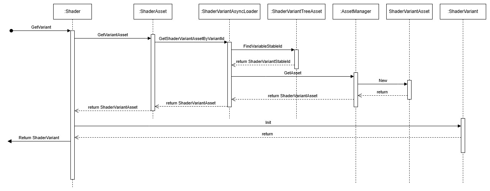

### Summary:
Graphics APIs expose a number of methods for setting values within shader code during runtime. Uniform buffer objects (UBOs) are one of the most common approaches when it is necessary to set values within a shader at runtime and are used in many applications. UBOs are pushed to the shader just prior to its execution, this is after shader compilation which occurs during Pipeline creation. As these values are set after the shader has been compiled, the driver’s shader compiler has limited scope to perform optimizations to the shader during its compilation. This is because optimizations such as loop unrolling or unused code removal require the compiler to have knowledge of the values controlling them which is not possible with UBOs. Push constants, another method for setting shader values, also suffer from the same problems as UBOs, as they are also provided after the shader has been compiled.

Unlike UBOs, specialization constants are set before pipeline creation meaning these values are known during shader compilation. This allows the driver’s shader compiler to perform optimizations. In this optimization process the compiler has the ability to remove unused code blocks and statically unroll which reduces the fragment cycles required by the shader which results in an increased performance.

### What is the relevance of this feature?
To answer this question we first need to understand about Shader Variant Options on O3DE. Shader variant options are shader constants that are only used in conditional statements that can be statically optimized. You can choose to compile them as static constants (asset build time) or as global variables (runtime).

Consider the following AZSL code snippet, where a shader variant option is used in a conditional branch:

```
    if (o_useRed) {
        color = float3(1, 0, 0);
    } else {
        color = float3(0, 0, 1);
    }
```

In the shader code above, the value of o_useRed is not known at compilation time, so o_useRed is compiled as a shader constant. The shader bytecode branches at runtime depending on the runtime value of o_useRed. In general, branching is slow and should be avoided.

In this scenario, if the value of o_useRed is defined as true at compilation time, then the compiler produces the following branch-less code.

    color = float3(1, 0, 0);
If o_useRed is defined as false at compilation time, then the compiler produces the following branch-less code:

    color = float3(0, 0, 1);
The example above produces three different versions of the compiled shader code (one with o_useRed = true, another with o_useRed = false, and another with o_useRed = undefined). These are called shader variants (ShaderVariantAsset). In order to get the best performance, 3 different shader compilations had to be done, and 3 new assets had to be created. As more shader variant options are added, the number of different combinations between them grows exponentially. It’s almost impossible to build all possible combinations of shader variant options for a typical project. So how do you know which shader variants to build? O3DE uses a combination of scripts (to crawl the materials being used for example) and user input (with the help of the Shader Management Tool) to build a list with the shader variants to generate. Since this list is only a subset of all possible combinations, what happens if the specific combination was not built during asset processing? Luckily O3DE has a fallback system, where shader variant options values are set at runtime using a UBO, so the proper shader code is executed. Unfortunately, as previously stated, the driver is unable to optimize shader variant values during Pipeline creation, since their values are not known at compilation.

Now that we know how shader variant options drive the shader generation, it’s not hard to see how specialization constants can help. When using them, we can get the benefits of compile time optimization without the cost of having to create multiple variants of a shader. At runtime, using the specialization constant values, the shader is specialized when a new Pipeline object is built. This way the driver can optimize the shader knowing the values of the specialization constants, since they will not change during the lifetime of the specialized shader. Generating a list of shader variants to use is not needed, since only one variant is created during asset generation.

### Feature design description:
Adding the use of specialization constants for shader variant options will be almost transparent for developers. The new design only changes the way shader variant options are implemented, not the way they are used. Developers will continue to create shaders with shader variant options in the same way as before, and all current shaders will continue to work without changes.

Since not all graphics APIs support specialization constants, it is critical that the current support for shader variant options remain in the codebase.  There will be 3 different ways of specifying when to use specialization constants: a global setting per API, a setting per shader and a setting per shader variant option.

Since specialization constants is a platform dependent feature, the first step is to analyze how they are implemented in the supported graphic APIs on O3DE:

**Vulkan**

Specialization constants in Vulkan are a mechanism allowing a constant value in SPIR-V to be specified at VkPipeline creation time. Vulkan supports multiple types as specialized constants (int, float, bool, etc). The first step to use them is declaring specialized constants in the shader. Fortunately DXC provides a simple attribute for promoting a global constant to a specialized constant.

```
[[vk::constant_id(1)]] 
const float o_myColor = 1.0;
```

The next step is providing the proper constant values in order to specialize the shader. This is done during the pipeline generation, since this is the moment that the driver compiles the SPIR-V into ISA code. To accomplish this a VkSpecializationInfo struct must be filled with the proper values for each of the shader stages in the pipeline. The following example describes the process:

```
struct myData {
    float myColor = 1.0f;
} myData;

VkSpecializationMapEntry mapEntry = {};
mapEntry.constantID = 0; // matches vk::constant_id in HLSL 
mapEntry.offset     = 0;
mapEntry.size       = sizeof(float);

VkSpecializationInfo specializationInfo = {};
specializationInfo.mapEntryCount = 1;
specializationInfo.pMapEntries   = &mapEntry;
specializationInfo.dataSize      = sizeof(myData);
specializationInfo.pData         = &myData;

VkGraphicsPipelineCreateInfo pipelineInfo = {};
pipelineInfo.pStages[fragIndex].pSpecializationInfo = &specializationInfo;

// Create first pipeline with myColor as 1.0
vkCreateGraphicsPipelines(&pipelineInfo);

// Create second pipeline with same shader, but sets different value
myData.myColor = 0.5f;
vkCreateGraphicsPipelines(&pipelineInfo);
```

**Metal**

Specialization constants are called function specialization on Metal. Like Vulkan, it supports multiple data types as constants. To declare a function constant in a Metal shader you use the following syntax:

`constant float o_myColor [[function_constant(1)]];`

When creating the pipeline object, the proper constant values must be pass:

```
struct myData {
    float myColor = 1.0f;
} myData;

MTLFunctionConstantValues* values = [MTLFunctionConstantValues new];
[values setConstantValue: &myData.myColor
                                 Type: MTLDataTypeFloat
                        withName: “Color”];

MTLRenderPipelineDescriptor *dsc = [MTLRenderPipelineDescriptor new];
NSError *error = nil;
dsc.fragmentFunction = [shader_library newFunctionWithName:@”main”
				          		                       constantValues:values 
                                                                                                error:&error];
```

**DX12**

DX12 doesn’t support specialization constants. It has been requested by the [community ](https://github.com/microsoft/hlsl-specs/issues/71), but at the moment there’s no plans to include them. Luckily, there’s an implementation from the developers of Godot engine (which is open source) that supports something similar to specialization constants on DX12. The approach is described in full in the this [article ](https://godotengine.org/article/d3d12-adventures-in-shaderland/). The basic idea is to use a constant with a “magic” value that can be detected, so at runtime it can be patched using the proper value. There’s a lot of more details, since you need to find, update and delete DXIL instructions in order to properly patch the shader. One of the downsides of this solution is that any modification to the DXIL shader bytecode requires a re-sign. To do that, a specific DLL (dxil.dll) from Microsoft must be included with the engine (and any application built with it). There are some projects that were able to reverse engineer the shader bytecode signing algorithm without the DLL (https://devlog.hexops.com/2024/building-the-directx-shader-compiler-better-than-microsoft/). As part of the investigation for this RFC, I was able to create a functional proof of concept of Godot’s technique on O3DE. The patching works as expected but only supports int, floats and booleans types.

### Technical design description:

Shader variant options can only be of type bool, int, or enum. They cannot be of type float or struct. Fortunately, all graphics APIs on O3DE support the necessary types as specialization constants.

#### Generating shaders with specialization constants

During the shader generation process, the first step is generating the HLSL code from the AZSL shader. To do this, O3DE uses the AZSLc compiler. One of the jobs of AZSLc is translating shader variant options (declared as an “option” in AZSL language) into the proper HLSL instructions. We need to tell AZSLc that we will be using specialization constants, because this modifies how the “options” are being translated. A global option for enabling the use for specialization constants for all shader options will be added. This option will be enabled via command line:

`–sc-options`

Since shaders can override the command line arguments that are passed to AZSLc, each shader could also decide to disable or enable the use of specialization constants (remove or add argument '-sc-options')

The generation of specialization constants varies from graphics APIs. AZSLc already has a per platform code emitter, so we just need to add some new functionality to the existing PlatformEmitter interface:

```
 struct PlatformEmitter 
 {
….
 [[nodiscard]]
 virtual string GetSpecializationConstant(const CodeEmitter& codeEmitter, 
                                                                 const IdentifierUID& symbol, 
                                                                 const Options& options, 
                                                                 uint32_t id) const;
…
}
```

For certain use cases a shader variant option may perform better if it's baked during shader compilation (instead of using specialization constant). To handle this case a new attribute will be created which will force the use of the static method of #define (the current system) for a specific shader variant option.

```
[[no_specialize]]
option bool o_useNoiseTexture = true;
```

In the case of Vulkan, we just need to emit a single global constant with the [[vk::constant_id]] attribute. DXC will properly convert that into the SPIR-V specialization constant opcode. For Metal, the process is exactly the same, since O3DE first converts from HLSL to SPIR-V, and then from SPIR-V to MSL using SPIR-V Cross Compiler. Thankfully, SPIR-V Cross already supports specialization functions, so there’s nothing extra that we need to do for Metal. 

DX12 is a completely different case. Since DX12 doesn’t really support specialization constants we need to do some extra steps. First, AZSLc needs to transform shader variant options to “volatile” variables with an initialization value. Why volatile? This attribute prevents DXC from optimizing them during the compilation process. We need the variables to exist in the generated DXIL so we are able to patch them at runtime. Since volatile is a valid attribute only for local variables we need to encapsulate them in a function:

```
bool GetShaderVariantKey_o_enableFogLayer()
{
    volatile int sc_enableFogLayer = 1;
    return (bool) sc_enableFogLayer;
}
```

The next step is to replace the generated “volatile” variables for real constants in the generated DXIL code. To accomplish this, a new tool called “DXSC” will be created in the forked DirectxShaderCompiler project. DXSC needs access to many LLVM and dxc functionality, so it makes sense to have it inside the DirectxShaderCompiler project. DXSC will replace the “volatile” variables with a special constant value. This value acts like a sentinel that we can later detect when doing the patching. This sentinel value has to be carefully selected so the probability to clash with a real value in a shader is low. When the sentinel value is detected, how does it know which specialization constant it belongs to? We use the initialization value of the “volatile” variable that we generated (e.g. 1 in the previous example) as the specialization constant index.  Then, when generating the replacement value, we add this index to the sentinel to get the final value. This way, when detecting the sentinel, we can also extract the specialization constant index from the detected value. Since the runtime will not get access to LLVM code, we need a way to easily patch the specialization constants in the DXIL bytecode. To do this, DXSC will also output an offset for each specialization constant with the location of that constant in the shader bytecode. Using this information, the runtime can easily patch each specialization constant at the proper location. The offset information will be added to the ShaderStageFunction class.

```
class DX12::ShaderStageFunction
  : public RHI::ShaderStageFunction
{
…
  using SpecializationConstantOffsets = AZStd::unordered_map<uint32_t, uint64_t>;
  AZStd::array<SpecializationConstantOffsets, ShaderSubStageCountMax> m_scOffsets;
…
}
```
#### Specializing shaders

Once we have the shaders built with specialization constants we need to create the Pipeline objects with specialized shaders. To accomplish this we need to pass the values for the specialization constants when building the Pipeline. This information will be added to the PipelineStateDescriptor class:

```
using SpecializationValue = RHI::Handle<uint32_t, struct SpecializationConstant>;

enum class SpecializationType : uint32_t
{
    Integer,
    Bool,
    Enumeration,
    Invalid
};

struct SpecializationConstant
{
    SpecializationConstant() = default;

    SpecializationValue m_value;
    Name m_name;
    uint32_t m_order = 0;
    SpecializationType m_type = SpecializationType::Invalid;

    bool operator==(const SpecializationConstant& rhs) const;
    HashValue64 GetHash() const;
};

class PipelineStateDescriptor
{
…
    AZStd::vector<SpecializationConstant> m_specializationData;
…
}
```

With the specialization constant values, each RHI can create the pipeline with the proper specialized shaders. On Vulkan, you just need to fill up the VkSpecializationMapEntry struct for each constant, and then use a VkSpecializationInfo struct when calling the VkCreateGraphicsPipelines or VkCreateComputePipelines function. On Metal, it’s something similar. We need to populate a MTLFunctionConstantValues object with the constant values, and then use that when creating the fragment/vertex/compute function of the MTLRenderPipelineDescriptor object. DX12 is a more complex process. Using the offsets that were calculated by the new tool DXSC, we know the exact location of each specialization constant in the shader bytecode. With that information we can replace the sentinel value with the proper constant value that was passed in the PipelineStateDescriptor. Special care has to be taken when writing the constant value. LLVM uses a Variable Width Integer encoding when writing integers into the bytecode (https://llvm.org/docs/BitCodeFormat.html#variable-width-integer). In order to do a proper replacement, we must follow the same rules of encoding when writing the new value. After the patching, the new shader bytecode must be signed so it is accepted by the GPU drivers. To do this we need to use the DLL provided by Microsoft. After signing, the process continues as normal.

#### Choosing the Shader Variant

Shaders on O3DE are represented by a .shader file. Those shaders are processed and saved as ShaderAsset files. This asset doesn’t really contain the shader bytecode, that information is stored in a ShaderVariantAsset file. Each of them represents the compilation of the shaders stages with a specific combination of shader variant options. O3DE also uses another asset (ShaderVariantTree) that is in charge of managing all the different ShaderVariantAsset files that were generated. 

The runtime code has 2 classes, the Shader and ShaderVariant class, that manages the access to their asset equivalent. In order to compile a Pipeline, the runtime code has to access a ShaderVariant object that provides a method of getting the shader bytecode (in a ShaderVariantAsset object). O3DE uses two IDs to reference a ShaderVariant, the ShaderVariantId and the ShaderVariantStableId. The first one uses a bitset structure to save the values of the shader variant options that were used for generating a variant (very important to us since it will be used for populating the specialization constants). The second one is a generated unique id that was created by a tool when the ShaderVariantAsset file was built (e.g. Shader Management Tool). 

The current flow for accessing a ShaderVariant is the following:



One important point to mention is that the requested ShaderVariant may not be exactly the one requested. The exact combination of shader variant options requested may not exist (it was never built) or it may be in the process of loading. O3DE returns the closest match, where some shader variant options may be baked at compile time, and others will need to be set at execution time using the fallback system. In the worst case, the root shader variant is returned (the one that doesn’t have any shader variant options set at compile time and it’s 100% dynamic) which is always available.

Now that we know how shader variants are built and accessed, let's see how specialization constants would change this. When using specialization constants only a few ShaderVariants needs to be generated (only the root unless there's a shader option with the [[no_specialize]] attribute).  The ShaderVariant can be specialized with the proper constant values at Pipeline creation time for all the different shader variant options combination. For this process we have 2 options:

- Currently the ShaderVariant has the same ShaderVariantId and ShaderVariantStableId as the ShaderVariantAsset. This is because one ShaderVariant represents one specific ShaderVariantAsset. We could modify the ShaderVariant to have its own ShaderVariantId and  ShaderVariantStableId and share the ShaderVariantAsset between multiple variants (which is where the shader bytecode lives). In this way the ShaderVariant will represent an “exact” match for the shader variant options being used. Technically the shader bytecode doesn’t have the constant values baked in during compilation, but they will be once the specialization constants are used for building the Pipeline. For the ShaderVariantStableId we can just generate a unique one per ShaderVariantId at runtime as needed.
This approach is very handy, because the ShaderVariant class already has a “ShaderVariant::ConfigurePipelineState” method that handles filling up a PipelineStateDescriptor. We just need to add the specialization constants configuration using the ShaderVariantId (which holds the values for the shader variant options). And moreover, this method is already used by all passes and RPI code to fill up the Pipeline descriptor, so no code will need to change for those that are using ShaderVariant::ConfigurePipelineState.

- We keep the ShaderVariant as it is, and we always use the root ShaderVariant (since it’s the only one and we can specialize it). Then, we would need to create another function similar to ShaderVariant::ConfigurePipelineState, where using a ShaderVariantId or a ShaderOptionGroup as argument, we configure the specialization constants in the Pipeline descriptor. We cannot use the ShaderVariantId of the ShaderVariant to do this, because it doesn’t contain the values for the shader variant options. Then we would need to add a call to this newly created function in all the places where ShaderVariant::ConfigurePipelineState is being used. This approach requires more changes in the calling code, but keeps the ShaderVariant and ShaderVariantAsset relationship intact.

### What are the advantages of the feature?
There’s 2 major advantages from using specialization constants for shader variant options. The first one is improving the asset generation by reducing the number of shader variants that need to be created. Since only a couple of shader variant are created per shader, we save compiling all other variants. In some projects that could be hundreds or even thousands of compilations. Not only we save time in processing the assets, but also the size of the project's assets is reduced.

The second one is improving shader performance. With specialization constants the “perfect” shader variant is always used. This means that the driver can optimize further by removing branching and conditional code, constant folding, loop unrolling and other optimizations. All of this translates to faster code, and specially less code. Less code is important, because it affects the number of registers that are needed for executing a shader. Having a branch for example means that the GPU has to reserve more registers to handle both branches. Less register equals to more waves can be spawned, which translates to more code executed per cycle.  

### What are the disadvantages of the feature?
Offline optimizations can sometimes be more efficient than runtime optimizations. This is mainly due to the processing power and time that offline compilations have. Because of this, baking shader variant options at runtime may result in shaders that are more optimized than their specialization constant version. This is one of the reasons that the decision to use specialization constants will be done per shader and per shader option (the default option per shader will be whatever the API is using, but that could be overwritten). 

### How will this be implemented or integrated into the O3DE environment?
Integration will be transparent for developers, meaning that almost no code of them will need to be changed. 
The only extra library that will be added is the Microsoft “DXIL.DLL” library which is used for signing DXIL bytecode at runtime. Currently this library is only used for generating the shader assets at build time.

### Are there any alternatives to this feature?
The alternative is the current implementation of shader variant options.

### How will users learn this feature?
Since it will not require developers intervention, a simple announcement of the feature will suffice. Documentation will need to be updated to show how users can disable specialization constants per shader.

### Are there any open questions?
The only open question is how ShaderVariants are selected. The proposed solutions are already outlined in the document.


