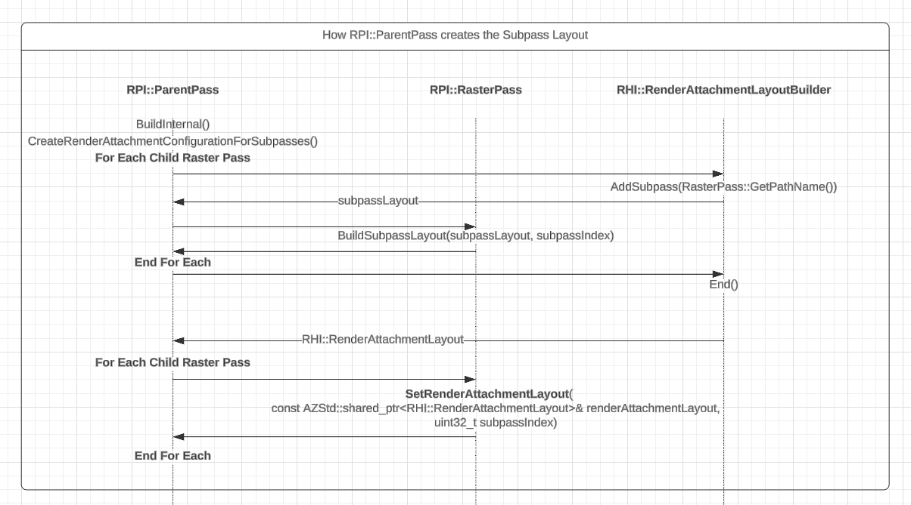
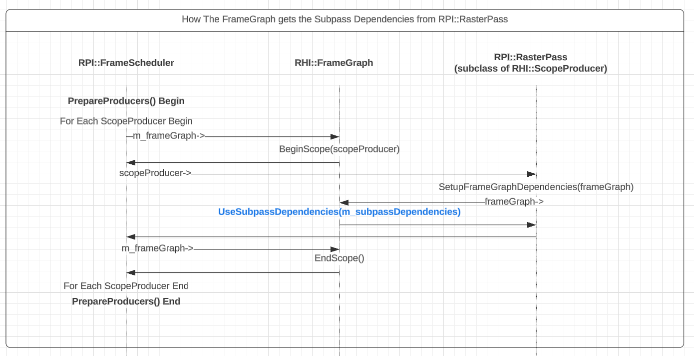

# A Solution To Expose Subpasses To The RPI

**Why is this important?**  
In terms of getting maximum graphics performance for the least amount of bandwidth on GPUs
architected as Tile Based Rasterizers(TBR, for short) you need to group as many Raster Passes
as possible into a series of Subpasses.

Most Mobile and XR devices have TBR GPUs. Both bandwidth and power consumption should be minimized.
Merging several Raster Passes as a sequence of Subpasses is one option available that typically achieves this goal. To learn more about Subpasses (In Vulkan):  
1. https://arm-software.github.io/vulkan_best_practice_for_mobile_developers/samples/performance/render_subpasses/render_subpasses_tutorial.html  
2. https://developer.qualcomm.com/sites/default/files/docs/adreno-gpu/snapdragon-game-toolkit/gdg/gpu/best_practices_tiling.html  
3. https://www.saschawillems.de/blog/2018/07/19/vulkan-input-attachments-and-sub-passes/


# O3DE Background History - Vulkan RHI
In order to understand the proposed solution, it is very important to go over a few touch points on how the RPI and RHI work together to define the Frame Graph and how it gets executed.  
  
Each time the RPI initializes a Shader, it also instantiates a Pipeline State Object (aka PSO) for the given Shader (for a given Shader Variant to be precise). Vulkan requires a VkRenderPass to instantiate a PSO:  
```
// Internally, the RHI creates or re-uses a VkRenderPass to create ShaderPSO.
ShaderPSO = Shader->AcquirePipelineState()
```
In the pseudo code mentioned above let's assume the Vulkan RHI created a private `VkRenderPass0`.

 Later when the Vulkan RHI compiles the Scopes it creates a new `VkRenderPass1` and when submitting Draw commands the following pseudo code happens:
```
CmdBeginRenderPass(VkRenderPass1)
    CmdBindPSO(ShaderPSO)
    CmdDraw(...)
CmdEndRenderPass() 
```
And here comes the first lesson, Vulkan does NOT require `VkRenderPass0` and `VkRenderPass1` to be identical, BUT they have to be **compatible**. Compatible usually means that both VkRenderPasses must be crated by referring to the exact same type and amount of Frame Attachments, and also means that **if there are Subpass Dependency declarations, those declaration must be identical**, otherwise validation errors or crashes may occur.  

In the example above, `VkRenderPass0` is created with help of the API `AZ::RHI::Vulkan::RenderPass::ConvertLayoutAttachment()`, while `VkRenderPass1` is created by a different code path: `AZ::RHI::Vulkan::RenderPassBuilder`. The key takeaway is that because there was no subpass support exposed to the RPI it was relatively easy that two different code paths end up creating compatible VkRenderPasses.  

Let's go over a slightly more complicated scenarion where two consecutive Raster Passes are executed by the RHI.
Also let's assume each Raster Pass have their own shader:  
```
// Somewhere in the RPI at initialization time:

// Shader used under Raster Pass A
ShaderPSOA = ShaderA->AcquirePipelineState() // Internally VkRenderPassA is created.

// Shader used under Raster Pass B
ShaderPSOB = ShaderB->AcquirePipelineState() // Internally VkRenderPassB is created.
... 
A few seconds later
...
CmdBeginRenderPass(VkRenderPassC) //Scope of Raster Pass A
    CmdBindPSO(ShaderPSOA)
    CmdDraw(...)
CmdEndRenderPass() 
CmdBeginRenderPass(VkRenderPassD) //Scope of Raster Pass B
    CmdBindPSO(ShaderPSOB)
    CmdDraw(...)
CmdEndRenderPass() 
```
The example above worked fine because `VkRenderPassC` was compatible with `VkRenderPassA`, and `VkRenderPassD` was compatible with `ShaderPSOB`.  
  
Let's go over the final example, where we assume that `Raster Pass A` & `Raster Pass B` are mergeable as subpasses:  
```
// Somewhere in the RPI at initialization time:

// Shader used under Raster Pass A (as Subpass 0)
ShaderPSOA = ShaderA->AcquirePipelineState() // Internally VkRenderPassA is created.

// Shader used under Raster Pass B (as Subpass 1)
ShaderPSOB = ShaderB->AcquirePipelineState() // Internally VkRenderPassB is created.
... 
A few seconds later
...
CmdBeginRenderPass(VkRenderPassC) //Merged Scope of Raster Pass A & B
    CmdBindPSO(ShaderPSOA)
    CmdDraw(...)
CmdNextSubpass() //Scope of Raster Pass B
    CmdBindPSO(ShaderPSOB)
    CmdDraw(...)
CmdEndRenderPass() 
```
For this final example to work well, all VkRenderPasses must be compatible: VkRenderPassA, VkRenderPassB and VkRenderPassC, and **most importantly** the VkSubpassDependency's must be identical. The challenge is that VkSubpassDependency is nothing more than a combination of Bit Flags and it can be tedious to write two different code paths that generate the exact same Bit Flags.  


# The Solution
  
There are many considerations in this solution:  

## Solution to Shareable Render Attachment Layouts
So far each RPI::Pass has been constructing their Render Attachment Layouts in isolation (See `AZ::RPI::RenderPass::GetRenderAttachmentConfiguration()`) and it is precisely the Render Attachment Layout what contains all the data that describes Render Attachments and dependecies for each subpass.  
The new change in the Pass asset is that `PassData` contains a new field called `"MergeChildrenAsSubpasses"`, which the `RPI::ParentPass` class can use to merge/combine a list of `RPI::RasterPass` as subpasses. The benefit of delegating the responbility to `RPI::ParentPass` is that it can sequentially build a single AZ::RHI::RenderAttachmentLayout for all the child passes that it is supposed to merge.  

The major piece of work is encompassed by the new function:   `AZ::RPI::ParentPass::CreateRenderAttachmentConfigurationForSubpasses()`.  
This function is called just after BuildInternal() is called for all Child passes.  
The reason this is the best time to call this function is because the RPI has not called `AZ::RPI::RenderPass::GetRenderAttachmentConfiguration()` yet for any of the PSOs.  
  
Also  `AZ::RPI::RenderPass::GetRenderAttachmentConfiguration()` was changed to `virtual`. This allows RPI::RasterPass to override `GetRenderAttachmentConfiguration()` and returned the Render Attachment Configuration that was built with help of `RPI::ParentPass`.

## Solution to Subpass Dependencies
As mentioned already, it is a burden to have two different code paths, and guarantee that they both will create the exact same set of bitflags that make a set of VkSubpassDepency's. Another problem is that We need to have APIs that the RPI can use, which should decouple from the intricacies of the Vulkan RHI... Introducing `AZ::RHI::SubpassDependencies`. This abstract class will serve as an opaque handle returned by each RHI that supports Subpasses. In particular, for Vulkan, a concrete implementation will be `AZ::Vulkan::SubpassDependencies: public AZ::RHI::SubpassDependencies`.  

The `RPI::ParentPass` will build the RenderAttachmentLayout for each subpass with the help of `RHI::RenderAttachmentLayoutBuilder` which in turn will invoke the NEW `AZ::Interface` named `AZ::RHI::SubpassDependenciesBuilderInterface` which provides the function:  
```cpp
virtual AZStd::shared_ptr<SubpassDependencies> BuildSubpassDependencies(const RHI::RenderAttachmentLayout& layout) const = 0;
```
The returned shared pointer will be shared by all Child Passes of type RPI::RasterPass, which they will later use when the FrameScheduler calls `RPI::Pass::SetupFrameGraphDependencies(RHI::FrameGraphInterface frameGraph)`.  
RasterPasses that are being merged will call: 
```cpp
    if (m_subpassDependencies)
    {
        frameGraph.UseSubpassDependencies(m_subpassDependencies);
    }
```
Deep down the line each `AZ::Vulkan::Scope` stores the shared pointer and the `AZ::Vulkan::RenderPassBuilder` would check if the shared pointer is valid and use it to create the VkRenderPass.  

The following timeline diagram illustrates how the `RHI::SubpassDependencies` handle is created during `RPI::ParentPass::BuildInternal()`:  


  

In the next, second phase, RPI::RasterPass, when marked as a subpass, forwards the `RHI::SubpassDependencies` handle during FrameGraph compilation. This is the timeline:  

  
  
The key event in the picture, above, is when `RPI::RasterPass` calls `frameGraph.UseSubpassDependencies(m_subpassDependencies)`, because that's when each `AZ::Vulkan::Scope` gets a copy of the `AZStd::shared_ptr<RHI::SubpassDependencies>`, which will be used later when creating the VkRenderPass.

In the final, third phase, this is the callstack on how the `AZStd::shared_ptr<RHI::SubpassDependencies>` of the **last** `AZ::Vulkan::Scope` is utilized to have all the data required to build a `VkRenderPass`:
```cpp
AZ::Vulkan::RenderPassBuilder::AddScopeAttachments(const AZ::Vulkan::Scope & scope)
{
    ...
    const auto* prebuiltSubpassDependencies = scope.GetNativeSubpassDependencies();
    if (prebuiltSubpassDependencies != nullptr)
    {
        if (prebuiltSubpassDependencies->m_subpassCount == m_renderpassDesc.m_subpassCount)
        {
            prebuiltSubpassDependencies->ApplySubpassDependencies(m_renderpassDesc);
        }
    }
    ...
}

>	Atom_RHI_Vulkan.Private.dll!AZ::Vulkan::RenderPassBuilder::AddScopeAttachments(const AZ::Vulkan::Scope & scope) Line 303	C++
 	Atom_RHI_Vulkan.Private.dll!AZ::Vulkan::FrameGraphExecuteGroupSecondaryHandler::InitInternal(AZ::Vulkan::Device & device, const AZStd::vector<AZ::RHI::FrameGraphExecuteGroup *,AZStd::allocator> & executeGroups) Line 30	C++
 	Atom_RHI_Vulkan.Private.dll!AZ::Vulkan::FrameGraphExecuteGroupHandler::Init(AZ::Vulkan::Device & device, const AZStd::vector<AZ::RHI::FrameGraphExecuteGroup *,AZStd::allocator> & executeGroups) Line 25	C++
 	Atom_RHI_Vulkan.Private.dll!AZ::Vulkan::FrameGraphExecuter::AddExecuteGroupHandler(const AZ::RHI::Handle<unsigned int,AZ::RHI::DefaultNamespaceType> & groupId, const AZStd::vector<AZ::RHI::FrameGraphExecuteGroup *,AZStd::allocator> & groups) Line 254	C++
 	Atom_RHI_Vulkan.Private.dll!AZ::Vulkan::FrameGraphExecuter::BeginInternal(const AZ::RHI::FrameGraph & frameGraph) Line 208	C++
 	Atom_RPI.Editor.dll!AZ::RHI::FrameGraphExecuter::Begin(const AZ::RHI::FrameGraph & frameGraph) Line 72	C++
 	Atom_RPI.Editor.dll!AZ::RHI::FrameScheduler::Compile(const AZ::RHI::FrameSchedulerCompileRequest & compileRequest) Line 218	C++
 	Atom_RPI.Editor.dll!AZ::RHI::RHISystem::FrameUpdate(AZStd::function<void __cdecl(AZ::RHI::FrameGraphBuilder &)> frameGraphCallback) Line 247	C++
 	Atom_RPI.Editor.dll!AZ::RPI::RPISystem::RenderTick() Line 357	C++
 	Atom_RPI.Editor.dll!AZ::RPI::RPISystemComponent::OnSystemTick() Line 184	C++

```
In the code snippet shown above, `scope.GetNativeSubpassDependencies()` returns the  `Vulkan::SubpassDependencies*`, which is the concrete implementation that the Vulkan RHI creates for the `RHI::SubpassDependencies` handle.