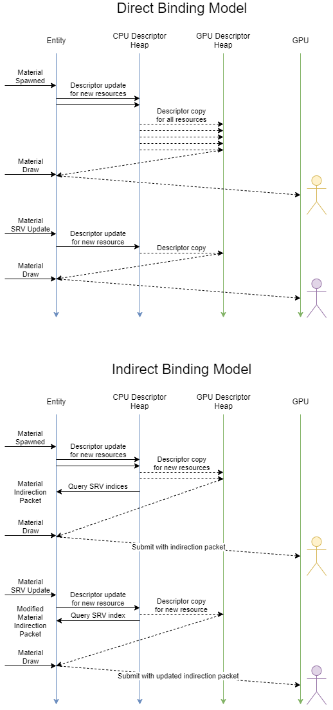

# RFC: Indirect shader resource bindings

## Terminology

* Pipeline State Object (PSO) - Bag of properties needed to specify a draw or dispatch submitted to the GPU
* Root Signature - D3D12 concept (analogous to Vulkan’s Pipeline Layout) specifying resource binding model in a PSO
* Shader Resource Group (SRG) - O3DE abstraction for specifying a layout within a root signature
* Indirect binding (aka “bindless”) - A method of binding resources via typically single indirection through a constant offset to descriptor table/heap (“indirect binding” is preferred to “bindless” because the resource *is* being bound, just not directly)
* Shader Resource View (SRV) - An GPU-visible descriptor to a region of memory + metadata (texture or buffer)
* Unordered Access View (UAV) - A GPU-visible descriptor to a region of writeable memory + metadata
* Instanced draw - A technique to draw multiple objects with a single command, with varying data (driven by instance id, or instance-rate data)
* Indirect draw - A technique to perform an instanced draw with data produced by the GPU
* Indirect multi-draw (also commonly referred to as “multi-draw indirect”) - A variation of indirect draw that permits GPU-driven draws associated with different PSOs
* Input Assembler (IA) - An early rasterization pipeline stage responsible for ingesting vertex data and performing any necessary format conversions

## Summary

In graphics engines, pipeline state objects (PSOs) define the GPU fixed-pipeline state, shader modules, and shader resource bindings. Currently, PSOs in O3DE’s Atom renderer are fully dynamic, and leverage fully direct bindings for the majority of its resources. This incurs a hefty per-frame performance cost to check if per-entity PSO changes are needed, perform actual PSO swaps, and update shader resource group (SRG) bindings. Furthermore, the PSO resource bindings themselves are “direct bindings,” mapping each resource to a slot bound to a specific descriptor table entry. Direct bindings, while conceptually convenient, prevent future optimizations that allow the renderer to drive scene rendering from more CPU-efficient instanced draws, or GPU-driven via indirect draws.

Adoption of this RFC proposes two things. First, AZSL will be extended to support SRGs that bind associated SRVs and UAVs with one or more levels of indirection. Second, GPU-visible SRV and UAV textures and buffers would be coalesced in a single managed heap, backed by a reference counting free-list. Indirection permits changing material properties that would alter resources bound, but not require any descriptor writes injected in the GPU timeline. Thus, the engine can immediately implement CPU-side optimizations to take advantage of material PSO and SRG invariance. It is expected that these changes are a necessary precursor to achieving instanced or GPU-driven scene rendering.

## What is the relevance of this feature?

Resource binding and efficient scene submission are two fundamental problems for every rendering engine. While there are many approaches, O3DE’s approach should strive to achieve the following:

* Minimal driver overhead
* State-of-the-art object submission throughput

At a high level, we want to eventually be able to rasterize triangle counts in the *millions*, and object counts in the *tens to hundreds of thousands*. There are a few known mechanisms for accomplishing this:

1. Drawing less (frustum culling, occlusion culling)
2. Precompiled PSOs (modern APIs submit PSOs and do driver validation asynchronously to accelerate submission)
3. Coalescing draws (instanced/indirect rendering)
4. Making draws more efficient (fewer PSO changes, fewer changes to the root arguments)

This RFC proposes changes to directly support item 3 above in the form of instanced rendering, with implications to support GPU-driven culling to support item 1 via (multi) indirect rendering per-PSO (barring driver/API extensions that allow shader changes on the GPU timeline). In addition, we expect improvements for item 4 as less state will change between draws.

*Simplification*: It’s worth noting that the ray-tracing pipeline already requires indirect resource binding, so this change would also unify the binding approaches used for both the ray-tracing pipeline and the rasterization pipeline. This same unified binding mechanism could be used to drive artist-authored terrain materials.

An objection may be that indirect resource access is a deoptimization relative to descriptor table entries or inline descriptors in the root signature. With respect to inline descriptors, it’s important to note that Vulkan does *not* have a notion of inline descriptors, because various IHVs do not support them. It is expected that most indirection constants needed can reside within a few cache lines at most, and can often be inlined in the root signature itself (i.e. submitted as push constants). Regarding indirect access compared to normal descriptor usage, the cost of the indirection should be amortized across indirection to multiple resources when the indirection constants occupy the same cache line. Furthermore, the advantages of indirection are known to generally vastly outweigh the latency penalty. Descriptors currently are managed in a way that is technically the worst-case scenario (any given resource has multiple identical descriptors referencing it).

## Feature Design Description

The high level changes proposed are as follows (items marked with a * are follow-on items that are not essential for the initial implementation) (:::::

1. Material property changes will be restricted to changes that do not modify the PSO
2.  `ShaderResourceGroupSemantic` declarations may specify a `IndirectBinding` property set to true (SRGs associated with a semantic with the `IndirectBinding` property are henceforth referred to as “ISRGs” (i.e. indirect SRGs)
3. Resources in an ISRG are bound and versioned in a global descriptor heap (referred to as *Managed Resources*)
4. The implicit struct associated with an ISRG is sub-allocated in a managed buffer with an offset
5. *Mesh data streams are promoted out of the IA and into SRVs
6. When accessing ISRG data and resources, the shader compiler will emit code to access the data/resource via the appropriate indirection constant, advancing by the packet size times `SV_InstanceID`
7. Support for ISRGs is opt-in using a CLI argument to `azslc`
8. Systems that don’t invoke instanced draws (e.g. terrain, raytracing) can override the mechanism for pulling indirection constants



## Technical Design Description

### Shader Binding Changes

**Direct Bindings (unchanged):** The current binding scheme is described below for clarity and will be preserved for cases where direct binding is needed, and also as a fallback mechanism for platforms that cannot support the indirect binding scheme. Currently, SRGs are defined in code that map directly to descriptor entries in the parent shader’s root signature. For example:

```
ShaderResourceGroup MaterialSrg: SRG_PerMaterial
{
   float3 m_baseColor;
   float m_baseColorFactor;
   uint m_baseColorMapUvIndex;
   Texture2D m_baseColorMap;
   // ... Other SRG entries
}
```

This is compiled to a few entries in the root signature (space 2 corresponds to the material frequency):

```
CBV [0, space = 2] BufferPage: MaterialSrg_SRGConstantBuffer
SRV Texture [0, space = 2] MaterialSrg_m_baseColorMap
SRV Texture [1, space = 2] MaterialSrg_m_roughnessMap
SRV Texture [4, space = 2] MaterialSrg_m_normalMap
// etc.
Static Sampler [0, space = 2] MaterialSrg_m_sampler
```

The contents of `MaterialSrg_SRGConstantBuffer` look like the following:

```
struct MaterialSrg_SRGConstantsStruct
{
    float3 MaterialSrg_m_baseColor;
    float MaterialSrg_m_baseColorFactor;
    uint MaterialSrg_m_baseColorMapUvIndex;
    float MaterialSrg_m_roughnessFactor;
    // ... Other SRG entries
}
```

Note that there are “holes” in the descriptor table assignment because some SRVs may be conditionally referenced in branches within shader code that aren’t actually used. Later, an entry in the SRG is referenced in `azsl` code as follows:

```
float4 albedo = MaterialSrg::m_baseColorMap.Sample(MaterialSrg::m_sampler, uv);
```

This is ultimately compiled to code that resembles the following:

```
float4 albedo = MaterialSrg_m_baseColorMap.Sample(MaterialSrg_m_sampler, uv);
```

**Indirect Bindings (new):** With an ISRG, the interface is similar, but a layer of indirection is used.

```
ShaderResourceGroupSemantic SRG_PerMaterial
{
    // This frequency corresponds to the frequency at which the indirection
    // packet will be bound
    FrequencyId = 2;

    // New property
    IndirectBinding = Instanced;
}

ShaderResourceGroup MaterialSrg : SRG_PerMaterial
{
    float3 m_baseColor;
    float m_baseColorFactor;
    uint m_baseColorMapUvIndex;
    Texture2D m_baseColorMap;
    // ... Other SRG entries
}
```

This will result in the following descriptor entries bound:

```
CBV [0, space = 2] BufferPage: MaterialSrg_InstancedIndirection
SRV ByteAddressBuffer [0, space = 32] ManagedHeap_ByteAddressBuffer
SRV Texture [0, space = 33] ManagedHeap_Texture2D
SRV Texture [0, space = 34] ManagedHeap_Texture3D
SRV Texture [0, space = 35] ManagedHeap_TextureCube
// ... Other SRV heaps
```

Note that instead of a dedicated slot, the indirection packet may be inlined as root constants. The register spaces used for the different types starts at an arbitrarily high constant to avoid conflicts with user-defined SRG semantics, and this offset is consistent across draws to keep the root signature stable. What’s shown is a hypothetical D3D12 binding scheme, but for Vulkan, the resources would alias within a sufficiently highly-indexed descriptor set. The CBV slot used here corresponds to a struct generated as follows:

```
struct ManagedIndirection
{
    uint index;
    uint offset;
};
ConstantBuffer<ManagedIndirection> MaterialSrg_Indirection : register(b0, space2);
```

The `index` shown above refers to the index of the `ByteAddressBuffer` SRV containing in the indirection constants, and the `offset` is the offset of the indirection data within that SRV.
The data itself is then bound to the space originally assigned to the `SRG_PerMaterial` semantic.
Furthermore, the following code used to access, say, the base color map:

```
float4 albedo = MaterialSrg::m_baseColorMap.Sample(MaterialSrg::m_sampler, uv);
```

would be compiled to effectively:

```
float4 albedo =
    ManagedHeap_Texture2D[
        ManagedHeap_ByteAddressBuffer[MaterialSrg_Indirection.index]
            .Load<uint>(MaterialSrg_Indirection.offset +
                SV_InstanceID * MaterialSrg_stride + MaterialSrg_m_baseColorMapOffset)
        .sample(MaterialSrg_m_sampler, uv);
```

The primary difference from the direct binding case is the indirection using the indirection constant.
The magic `MaterialSrg_stride` and `MaterialSrg_m_baseColorMapOffset` "variables" here are actually compile time constants emitted by the shader compiler.
A similar addressing scheme is used not just for other SRVs and UAVs within the SRG, but also the implicit struct associated with the SRG.

While such code could could be emitted for every SRV/UAV access, in practice, the implementation will likely write to shader static memory to avoid re-evaluating the indirection addresses.

In the future, additional indirection evaluation strategies may be added to the SRG or SRG semantic declaration as extensions.

**User-Supplied Indirection into Managed Resources (new):** Some shaders (terrain and ray-tracing) may want to directly access the managed resources by supplying the indirection constants from other means. This can be done by indexing directly into a member of an indirect SRG. For example, if we invoke the following code in a shader:

```
float4 albedo = MaterialSrg::m_baseColorMap[myIndex].Sample(
    MaterialSrg::m_sampler, uv);
```

The compiler will detect that presence of `myIndex` as an argument to the indexing operator and will use this index when supplying the indirection into the managed heap.

Subsequently, the user wishing to supply the indirection data will need to bind the indirection constants manually or pull them from an out-of-band location.

**Note on Non-uniform Resource Access:** When using a constant to index into an array, the HLSL compiler assumes that the array indexing operation is uniform (index value is the same across a quad). Non-uniform access will produce undefined behavior for hardware gradients and values derived from hardware gradients (e.g. LOD selection). As such, HLSL provides the `NonUniformResourceIndex` intrinsic function to indicate that a value may diverge across the quad lanes.

In the case of user-supplied indirection, the `NonUniformResourceIndex` intrinsic can be used directly, as in the following example:

```
float4 albedo = MaterialSrg::m_baseColorMap[NonUniformResourceIndex(myIndex)]
    .SampleLevel(MaterialSrg::m_sampler, uv, 0);
```

For access of a non-user-supplied resource access through an ISRG, resource access *must* be uniform, because the managed indirection constants will never diverge.

### Descriptor Versioning

Versioning of descriptors is already done in software to maintain unique resource descriptor entries in the CPU-visible descriptor heap. The CPU-descriptors are mapped verbatim to the shader-visible GPU descriptor heap, and versioned accordingly. Any descriptor updates/writes that occurred at the per-object granularity before, now occur once at the start of rendering across all active resources. Resources themselves may not need indirection, and descriptors mapping directly to such resources will be supported as before. Furthermore, for platforms that do not support indirect binding with unbounded arrays, we will simply disable generation of indirection layouts and code in shaders, and simply rely on the existing direct binding mechanism. In essence, the entirety of the CPU-visible descriptor heap will be exposed to shaders supporting indirection.

One implementation detail pertains to how descriptors to resources in SRGs and ISRGs are managed within the same descriptor heap. In this case, they are treated indistinguishably, and the entire heap is mapped as a single descriptor range in a single descriptor table.

### Binding Unification (Mesh data streams + Materials + Ray-tracing + Terrain)

For platforms that permit it, mesh data streams can be pulled using the indirect binding scheme instead of leveraging the input assembler. This should be considered a goal downstream from this RFC, as it requires decoupling material types from geometry to enable driving the mesh pipeline with arbitrary vertex/compute shaders.

Materials will leverage the indirect binding scheme wherever possible. However, some resources will continue to be bound directly. Such resources are expected to only change at pass, scene, and view frequencies however.

Ray-tracing, terrain, and other such shaders that rely on compositing materials are expected to supply indirection data into the managed resource bindings directly. Initially, this data may be queried from each relevant resource and supplied to a user-managed buffer resource. A downstream improvement, however, may pack all indirection constants and version the data within a set of buffers that permit yet another layer of indirection. The secondary indirection constant would point to the indirection packet used in the material indirect binding case.

### Platform RHI Considerations

**D3D12:** D3D12 supports indirect binding in SM6.6 without the need to alias different resource types manually behind distinct register spaces. However, to broaden support for pre-SM6.6 hardware, indirect binding per this RFC will leverage existing mechanisms in its implementation. Each resource type will get an unbounded array in a distinct register space, but at bind time, the same descriptor range will be assigned to each space.

**Vulkan:** Indirect binding will be supported for Vulkan devices that support the `VkPhysicalDeviceDescriptorIndexingFeaturesEXT` extensions. Specifically, the feature bits for `runtimeDescriptorArray` and `descriptorBindingPartiallyBound` must be set. Furthermore, SPIR-V allows direct aliasing of descriptors within the same register space in the shader declaration. To accommodate this from a single generated HLSL source, we can use [this](https://github.com/microsoft/DirectXShaderCompiler/blob/master/docs/SPIR-V.rst#descriptors) mechanism described in the DXC documentation.

**Metal:** Metal2 ships with support for argument buffers to provide indirect resource access, but there are varying tiers of hardware support (as with Vulkan).

**Unsupported Platforms:** Platforms that do not support the features needed will have ISRGs disabled. Instead, ISRGs will be treated identically to SRGs. Furthermore, features that rely on indirection directly through the managed resource heaps must be disabled. A future change may provide emulation or other workarounds to extend functionality in these cases (e.g. bounded arrays, restrictions to only permit uniform access, etc.). Mechanically, the fallback shader can be provided as a shader variant, leveraging the existing “supervariant” system.

## What are the advantages of this feature?

* Future GPGPU scene submission is possible, with immediate optimization opportunities for instanced draws
* Simplification of binding model and resource descriptor management across multiple systems (mesh data, ray tracing, terrain, materials)
* Abstraction built around ISRGs permits changing of the indexing scheme to enable alternative implementation strategies and improvements later
* Descriptor allocation and fragmentation costs scale with resource usage, not scene object complexity
* User doesn’t need to manage indirection constants themselves
* Existing functionality for managing descriptors with direct bindings is kept to support mixing-and-matching binding strategies

## What are the disadvantages of this feature?

* Adds more complexity to the shader compiler to emit indirection code
* Additional tooling will need to be invested in to debug indirection issues/bugs
* Resource access for ISRG resources requires an indirection (amortized if multiple indirection constants share a cache line)
* The performance improvements expected for this change will not affect hardware that doesn’t support the initial ISRG requirements (e.g. unbounded arrays)

## Are there any alternatives to this feature?

The other viable option is to use only the existing SRG functionality to provide the indirection entirely in user-space. However, this has two key drawbacks. The first drawback is that such an implementation has no real fallback strategy for platforms that don’t support indirect resource binding at the level needed, and must rely on a “lowest common denominator” for implementation. The second drawback is that the indirection scheme is hard-coded in shaders, and will be less amenable to future changes with how the indirection mechanism is performed. For example, changing where and how the indirection constants are stored would be challenging. Furthermore, it would increase the complexity of user-authored material shaders.

## How will users learn this feature?

The only new concept that would need to be documented for the user is the notion of the `IndirectBinding` property in the `ShaderResourceGroupSemantic` which will be presented alongside the existing SRG concept. Management of the indirection itself and bindings will be largely turnkey as with the existing SRGs. Users will likely be encouraged to use ISRGs primarily, as they permit draw instancing more readily, and direct SRGs will eventually be reserved for cases where the indirection is specifically not desired.

## Are there any open questions?

Mobile support for indirect resource binding is an open question, but is sidestepped here by providing a fallback path wherein ISRGs and SRGs are indistinguishable.

## References

* https://community.arm.com/developer/tools-software/graphics/b/blog/posts/vulkan-descriptor-indexing
* https://microsoft.github.io/DirectX-Specs/
* https://www.khronos.org/registry/vulkan/specs/1.2-extensions/man/html/VK_EXT_descriptor_indexing.html

